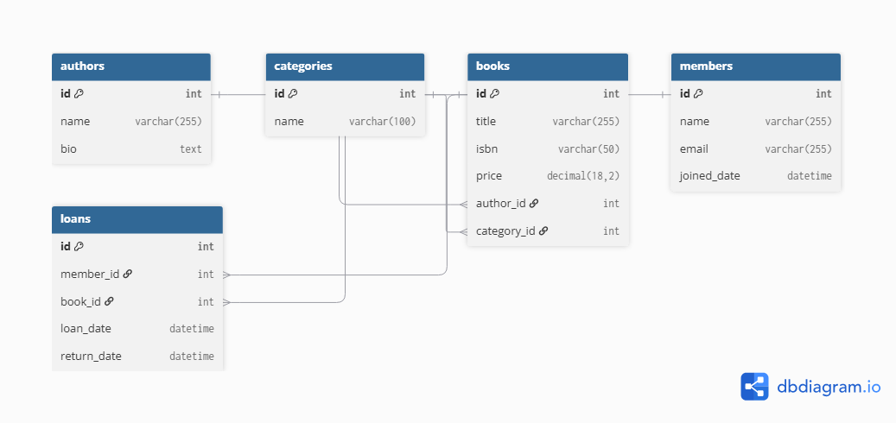

# Day 2 — SQL Server Schema Design & Normalization

## 1. Database Entities and Attributes

## Authors

| Column | Type | Description |
|--------|------|-------------|
| Id | INT | Primary Key |
| Name | VARCHAR(255) | Author name |
| Email | VARCHAR(255) | Author email |
| Bio | TEXT | Author biography |

## Categories

| Column | Type | Description |
|--------|------|-------------|
| Id | INT | Primary Key |
| Name | VARCHAR(100) | Category name |
| Description | VARCHAR(300) | Category description |

## Books

| Column | Type | Description |
|--------|------|-------------|
| Id | INT | Primary Key |
| Title | VARCHAR(255) | Book title |
| ISBN | VARCHAR(20) | International book number |
| Price | DECIMAL(18,2) | Book price |
| AuthorId | INT | Foreign Key referencing Authors |
| CategoryId | INT | Foreign Key referencing Categories |

## Members

| Column | Type | Description |
|--------|------|-------------|
| Id | INT | Primary Key |
| Name | VARCHAR(255) | Member name |
| Email | VARCHAR(255) | Member email |
| JoinedDate | DATETIME | Date the member joined |

## Loans

| Column | Type | Description |
|--------|------|-------------|
| Id | INT | Primary Key |
| MemberId | INT | Foreign Key referencing Members |
| BookId | INT | Foreign Key referencing Books |
| LoanDate | DATETIME | Borrowing date |
| DueDate | DATETIME | Expected return date |
| ReturnDate | DATETIME | Actual return date |

---

# 2. Normalization (1NF, 2NF, 3NF)

## First Normal Form (1NF)

The design follows 1NF by ensuring that all attributes contain atomic values and each column stores a single value only.

Examples:
- Book information is stored in separate columns instead of combining multiple values in one field.
- Authors and categories are stored in separate tables instead of repeating data inside the Books table.

This prevents multi-valued attributes and reduces data duplication.

## Second Normal Form (2NF)

The design follows 2NF because every non-key attribute depends on the complete primary key.

Each table uses a single-column primary key (`Id`), so there are no partial dependencies.

Examples:
- Book details depend on `Books.Id`.
- Member details depend on `Members.Id`.
- Loan details depend on `Loans.Id`.

## Third Normal Form (3NF)

The design follows 3NF by ensuring that non-key attributes depend only on the primary key.

Examples:
- Author information is stored in the Authors table instead of being repeated in every book record.
- Category information is stored in the Categories table instead of being repeated in the Books table.
- Member information is stored separately from Loans.

This prevents update anomalies and unnecessary data repetition.

---

# 3. Primary Keys and Foreign Keys

## Primary Keys

| Table | Primary Key |
|------|-------------|
| Authors | Id |
| Categories | Id |
| Books | Id |
| Members | Id |
| Loans | Id |

## Foreign Keys

| Foreign Key | References |
|------------|------------|
| Books.AuthorId | Authors.Id |
| Books.CategoryId | Categories.Id |
| Loans.MemberId | Members.Id |
| Loans.BookId | Books.Id |

---

# 4. Relationships

The database relationships are:

- Authors (1) → (Many) Books
- Categories (1) → (Many) Books
- Members (1) → (Many) Loans
- Books (1) → (Many) Loans

These relationships ensure data consistency and represent the real-world ownership between entities.

---

# 5. Column Type Decisions

| Data Type | Reason |
|----------|--------|
| INT | Used for primary and foreign keys because it is efficient for identifiers |
| VARCHAR | Used for text values with a defined maximum length |
| TEXT | Used for longer text such as biography |
| DECIMAL(18,2) | Used for prices to avoid FLOAT precision issues |
| DATETIME | Used for storing dates with time information |

---

# 6. ERD Diagram

The database schema was designed and visualized using dbdiagram.io.

The ERD shows:
- Entities
- Attributes
- Primary Keys
- Foreign Keys
- Relationships

