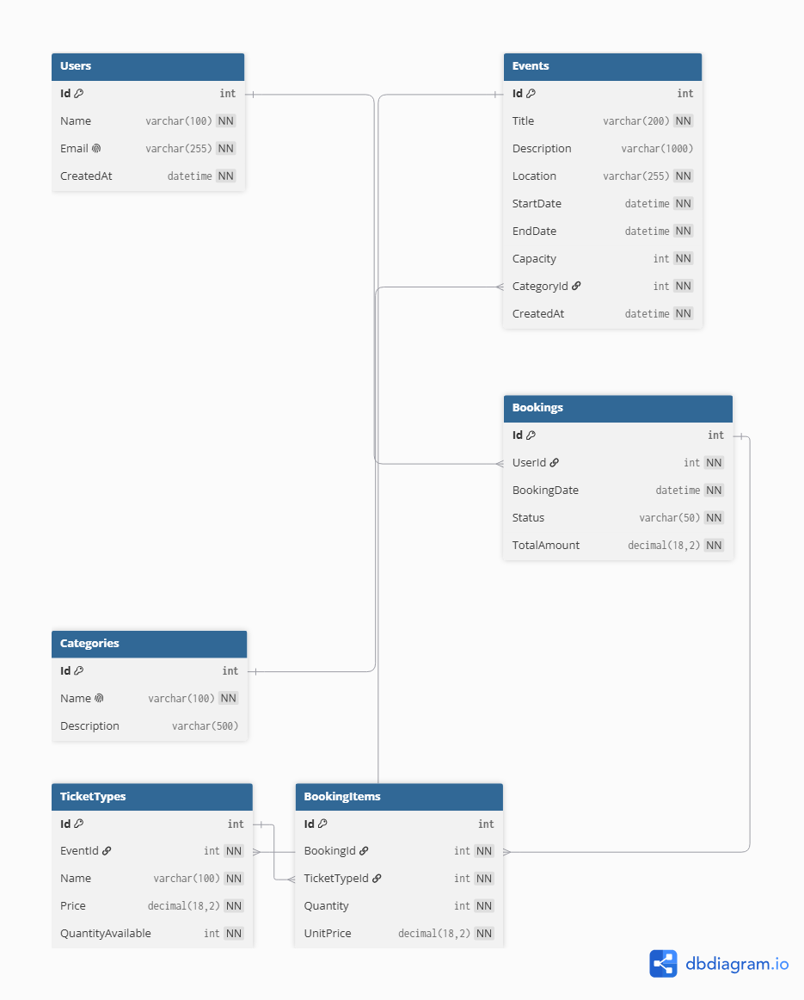

# EventHub — Day 1: Sprint 1 Planning & Database Design

## Project Overview

EventHub is an ASP.NET Core Web API for managing events, ticket types, and user bookings.

The project will be developed incrementally throughout Phase 3, starting with the database foundation and core routes in Sprint 1, then adding authentication, authorization, performance improvements, testing, documentation, and deployment in later sprints.

---

## Sprint 1 Goal

Build the foundation of the EventHub API by designing and documenting the complete database schema and preparing the core event, ticket, and booking flows.

---

## Day 1 Objectives

The main objectives for Day 1 are:

* Run Sprint 1 Planning.
* Define the Sprint 1 goal.
* Design the complete database schema.
* Identify the main entities and their relationships.
* Create and document the ERD.
* Break the Sprint 1 scope into realistic backlog tasks.

---

## Database Entities

The EventHub database is based on the following entities:

### Users

Represents users who can make bookings.

* Id
* Name
* Email
* CreatedAt

### Categories

Represents categories used to organize events.

* Id
* Name
* Description

### Events

Represents events available on the platform.

* Id
* Title
* Description
* Location
* StartDate
* EndDate
* Capacity
* CategoryId
* CreatedAt

### TicketTypes

Represents the different ticket types available for an event.

* Id
* EventId
* Name
* Price
* QuantityAvailable

### Bookings

Represents a user's booking.

* Id
* UserId
* BookingDate
* Status
* TotalAmount

### BookingItems

Represents the ticket types and quantities included in a booking.

* Id
* BookingId
* TicketTypeId
* Quantity
* UnitPrice

---

## Entity Relationships

The database relationships are:

* One Category can contain many Events.
* Each Event belongs to one Category.
* One Event can have many TicketTypes.
* Each TicketType belongs to one Event.
* One User can have many Bookings.
* Each Booking belongs to one User.
* One Booking can contain many BookingItems.
* Each BookingItem belongs to one Booking.
* One TicketType can be referenced by many BookingItems.

### Relationship Summary

```text
Category 1 ──── * Event
Event 1 ─────── * TicketType
User 1 ──────── * Booking
Booking 1 ───── * BookingItem
TicketType 1 ── * BookingItem
```

---

## ERD

The following ERD represents the database design that will be used as the reference for the implementation of the project.



The ERD will be kept synchronized with the actual EF Core data model as the project evolves.

---

---

## Day 1 Deliverables

At the end of Day 1, the following were completed:

* Sprint 1 goal defined.
* EventHub database entities identified.
* Complete database relationships designed.
* ERD created and documented.
* Sprint 1 backlog defined with estimated tasks.
* Initial Definition of Done established.

---

## Technologies

* C#
* ASP.NET Core
* Entity Framework Core
* SQL Server
* Git & GitHub
* dbdiagram.io

---

## Project Structure

The project will be developed incrementally throughout Phase 3.

```text
EventHub/
│
├── Week 06/
│   └── Day 01/
│       ├── README.md
│       └── eventhub-erd.png
│
└── EventHub/
    └── ASP.NET Core API
```

---

## Next Step — Day 2

Day 2 will implement the database design in Entity Framework Core by creating the entity models, configuring their relationships using the Fluent API, and generating the initial code-first migration.
