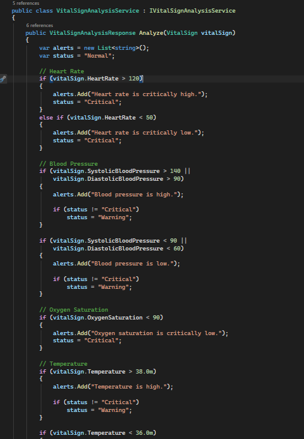
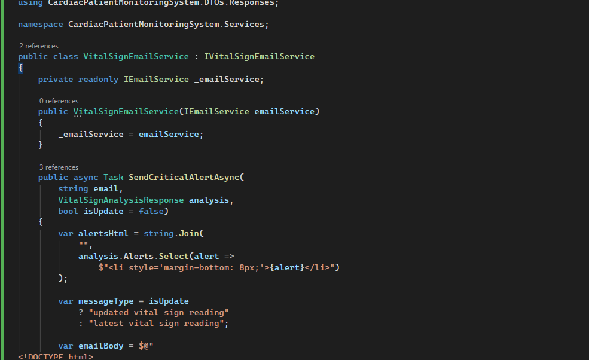
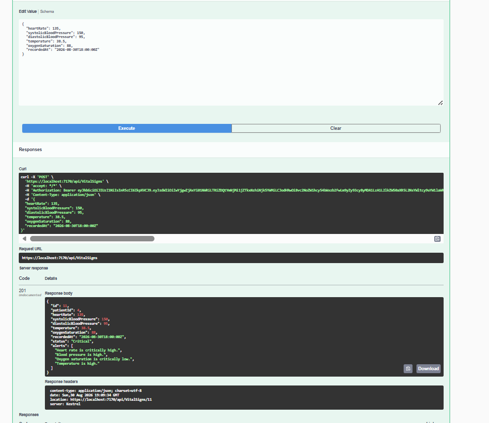
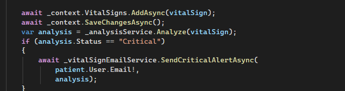
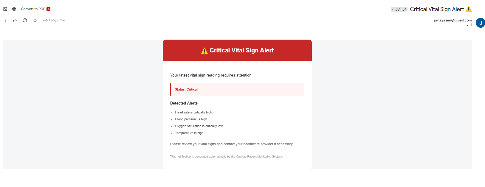
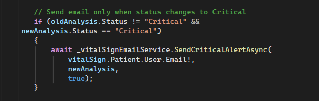

# Sprint 2 — Day 1

## Identity Integration & Vital Sign Monitoring

### Overview

Sprint 2 — Day 1 focused on integrating ASP.NET Core Identity into the existing Cardiac Patient Monitoring System and improving the Vital Signs feature with automated analysis, critical alerts, email notifications, and unit testing.

The implementation was organized to keep business logic separated into dedicated services and to make the system easier to maintain and extend.

---

## Day 1 Objectives

* Integrate ASP.NET Core Identity with the existing application.
* Update the application's `DbContext` to inherit from `IdentityDbContext`.
* Create and apply the required database migration.
* Define the application's role structure.
* Implement vital-sign analysis and status classification.
* Send email notifications when critical vital signs are detected.
* Add unit tests for the vital-sign analysis service.
* Document the implementation and testing results.

---

# 1. Identity Integration

The application's `AppDbContext` was updated to inherit from `IdentityDbContext<ApplicationUser>` instead of the regular `DbContext`.

This allows the application to use ASP.NET Core Identity features such as:

* Users
* Roles
* User-role relationships
* Authentication-related Identity tables

The Identity integration was also reflected in the existing database through a new migration.

---

# 2. Database Migration

After integrating Identity, a new EF Core migration was generated and applied to the existing database.

The migration was reviewed before applying it to ensure that the database changes matched the updated application model.

### Migration workflow

```text
Update AppDbContext
        ↓
Generate Migration
        ↓
Review Migration
        ↓
Apply Migration
        ↓
Existing Database Updated
```

---

# 3. Role Structure

The planned role structure for the Cardiac Patient Monitoring System is:

| Role    | Responsibility                                |
| ------- | --------------------------------------------- |
| Patient | Manage and view their own medical information |
| Admin   | Manage users and administrative operations    |

### Patient

Patients can access resources belonging to their own account.

Examples:

* View their vital signs
* Create vital-sign records
* Update their own vital-sign records
* Delete their own vital-sign records
* Manage their permitted medical information

### Admin

Administrators are intended to have access to administrative operations and management functionality.

---

# 4. Endpoint Authorization Plan

| Endpoint / Feature         | Patient | Admin |
| -------------------------- | :-----: | :---: |
| Authentication             |    ✅    |   ✅   |
| View own patient profile   |    ✅    |   —   |
| Update own patient profile |    ✅    |   —   |
| View own vital signs       |    ✅    |   —   |
| Create vital signs         |    ✅    |   —   |
| Update own vital signs     |    ✅    |   —   |
| Delete own vital signs     |    ✅    |   —   |
| Administrative operations  |    —    |   ✅   |

Authorization is based on the authenticated user's identity and role.

For patient-owned resources, the service also verifies that the requested resource belongs to the logged-in user.

---

# 5. Vital Sign Analysis

A dedicated `VitalSignAnalysisService` was used to keep vital-sign business rules separate from the record-management service.

The service analyzes:

* Heart Rate
* Systolic Blood Pressure
* Diastolic Blood Pressure
* Temperature
* Oxygen Saturation

Based on these values, the service returns:

* `Normal`
* `Warning`
* `Critical`

It also generates a list of alerts explaining which vital sign requires attention.

### Analysis flow

```text
Vital Sign Record
       ↓
VitalSignAnalysisService
       ↓
Check Vital Sign Values
       ↓
Determine Status
       ↓
Generate Alerts
       ↓
VitalSignAnalysisResponse
```

### Implementation



The analysis logic determines the overall status while preserving all detected alerts.

---

# 6. Critical Vital Sign Alerts

When a newly created vital-sign record is classified as `Critical`, the system automatically sends an email notification to the patient's email address.

The responsibility for generating and sending the email was separated into a dedicated service:

```text
IVitalSignEmailService
        ↓
VitalSignEmailService
```

This keeps email-related logic out of the main `VitalSignRecordService`.

### Email service implementation



---

# 7. Create Vital Sign Flow

When a patient creates a new vital-sign record:

```text
Patient
   ↓
Create Vital Sign Request
   ↓
VitalSignRecordService
   ↓
Save Record
   ↓
VitalSignAnalysisService
   ↓
Analyze Values
   ↓
Is Status Critical?
   ↓
   ├── No → Return Response
   │
   └── Yes
          ↓
   VitalSignEmailService
          ↓
   Send Critical Alert Email
```

### Critical analysis response



### Create Critical Alert



---

# 8. Critical Email Notification

When the vital-sign analysis returns `Critical`, an HTML email is generated and sent to the patient.

The email includes:

* Critical status
* Detected alerts
* A recommendation to review the vital signs
* An automatic notification message

### Received Email



This confirms that the critical-vital-sign workflow successfully reaches the email notification stage.

---

# 9. Update Vital Sign Flow

When an existing vital-sign record is updated, the system analyzes both the old and new values.

The email notification is sent only when the status changes from a non-critical state to `Critical`.

```text
Old Vital Sign
      ↓
Old Analysis
      ↓
Update Record
      ↓
Save Changes
      ↓
New Analysis
      ↓
Status changed to Critical?
      ↓
      ├── No → Return Response
      │
      └── Yes → Send Critical Email
```

This prevents sending another critical notification when a record was already in a critical state.

### Update Critical Alert



---

# 10. Unit Testing

xUnit was used to test the `VitalSignAnalysisService`.

The tests verify that the business rules produce the expected status for different vital-sign conditions.

### Example test scenario

A vital-sign record containing critically high heart rate and low oxygen saturation should result in:

```text
Status = Critical
```

### Test Structure

The tests follow the Arrange / Act / Assert pattern:

```text
Arrange
   ↓
Create service and test data
   ↓
Act
   ↓
Call Analyze()
   ↓
Assert
   ↓
Verify expected result
```

### Test Results

The test suite was executed using:

```bash
dotnet test
```

All implemented tests passed successfully.


---

# 11. Project Structure

The main Day 1 components are organized as follows:

```text
CardiacPatientMonitoringSystem
│
├── Controllers
│
├── Data
│   ├── AppDbContext.cs
│   ├── AdminSeedData.cs
│   └── RoleSeedData.cs
│
├── DTOs
│   ├── Requests
│   └── Responses
│
├── Models
│   ├── ApplicationUser.cs
│   ├── Patient.cs
│   └── VitalSign.cs
│
├── Services
│   ├── VitalSignAnalysisService.cs
│   ├── VitalSignRecordService.cs
│   ├── VitalSignEmailService.cs
│   ├── SmtpEmailService.cs
│   ├── IVitalSignAnalysisService.cs
│   ├── IVitalSignRecordService.cs
│   └── IVitalSignEmailService.cs
│
├── Validators
│
├── Middleware
│
└── Migrations
```

---

# 12. Key Design Decisions

### Separation of Responsibilities

Vital-sign responsibilities were separated into dedicated services:

```text
VitalSignRecordService
        │
        ├── Record Management
        │
        ├── VitalSignAnalysisService
        │          └── Business Rules
        │
        └── VitalSignEmailService
                   └── Email Notifications
```

This makes each service responsible for a specific concern.

### Ownership Validation

Patient requests are not trusted based only on the supplied `PatientId`.

The system identifies the patient using the authenticated `UserId` and verifies ownership before accessing or modifying vital-sign records.

### Critical Notification Rule

A critical email is sent:

* When a newly created record is `Critical`.
* When an updated record changes from a non-critical status to `Critical`.

This avoids unnecessary duplicate notifications.

---

# 13. Validation

Vital-sign records are also validated before being processed.

One business rule prevents users from recording a vital-sign reading with a future timestamp.

```text
RecordedAt > DateTime.UtcNow
        ↓
Reject Request
```

---

# 14. Technologies Used

* C#
* ASP.NET Core
* .NET 9
* Entity Framework Core
* ASP.NET Core Identity
* SQL Server
* xUnit
* SMTP Email
* RESTful APIs
* Git & GitHub
* Swagger / OpenAPI

---

# 15. Day 1 Outcome

By the end of Sprint 2 — Day 1, the project had:

* ✅ ASP.NET Core Identity integrated.
* ✅ `IdentityDbContext` configured.
* ✅ Database migration generated and applied.
* ✅ Patient and Admin roles planned.
* ✅ Endpoint authorization structure documented.
* ✅ Vital-sign analysis implemented.
* ✅ Normal / Warning / Critical statuses supported.
* ✅ Critical alerts generated.
* ✅ Automated critical email notifications implemented.
* ✅ Update notification logic implemented.
* ✅ Unit tests added using xUnit.
* ✅ All current tests passing.
* ✅ Implementation documented with screenshots.

---

## Evidence

The screenshots included in this README provide visual evidence of:

1. Vital-sign analysis implementation.
2. Email service implementation.
3. Critical vital-sign API response.
4. Critical alert during creation.
5. Critical alert during update.
6. Received critical email.
7. Successful unit-test execution.

---

## Sprint 2 — Day 1 Summary

The main focus of Day 1 was moving the system toward a more complete backend architecture by combining **Identity, authorization planning, business-rule processing, automated notifications, and testing**.

The implementation separates record management, vital-sign analysis, and email notification responsibilities while keeping patient data access restricted to the authenticated user's own records.
