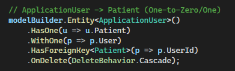
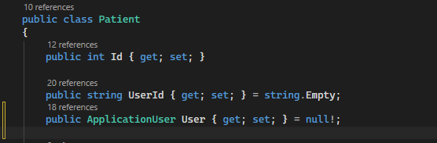
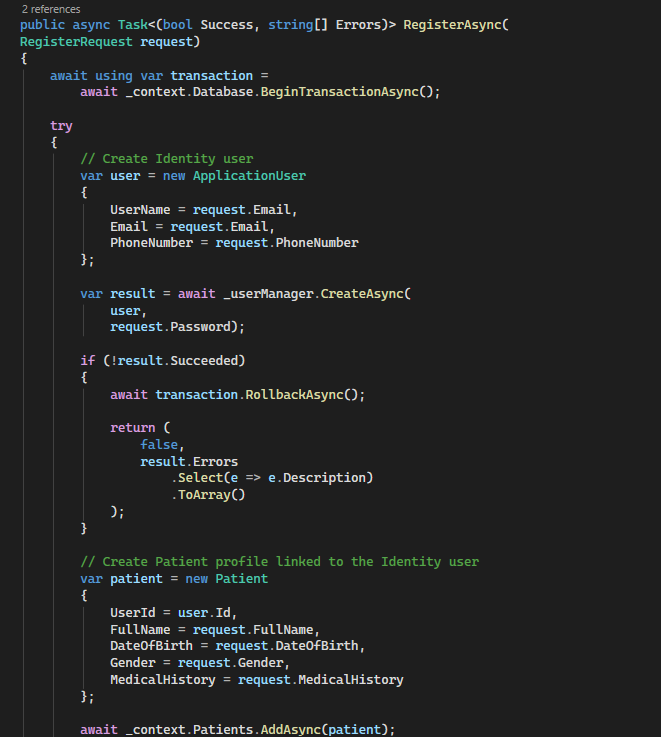
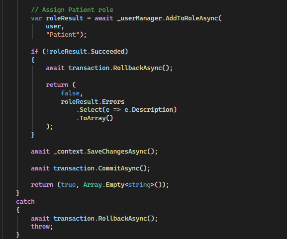
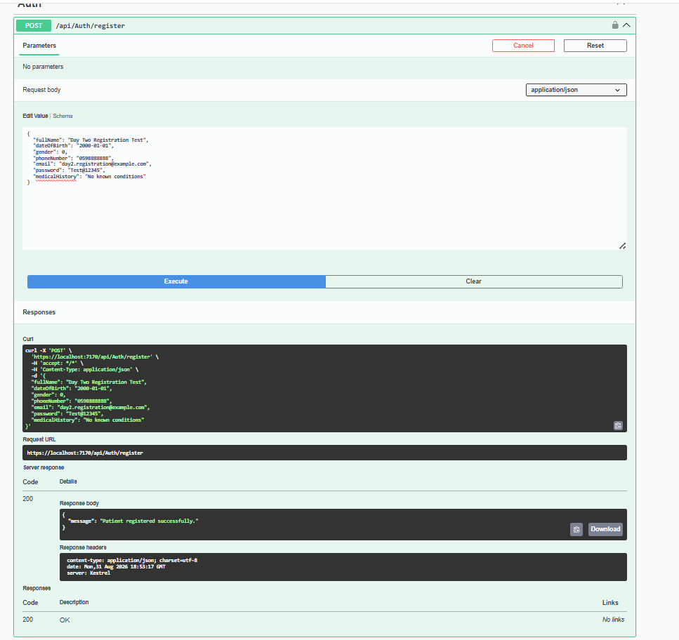
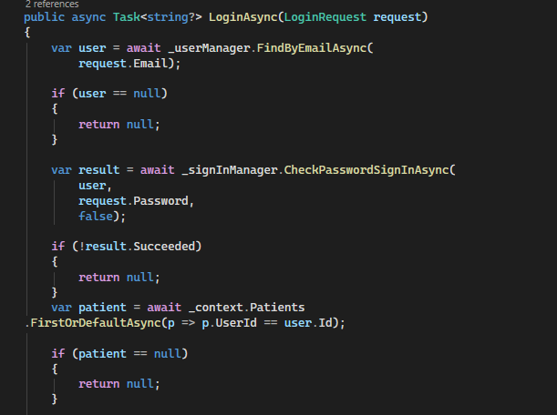
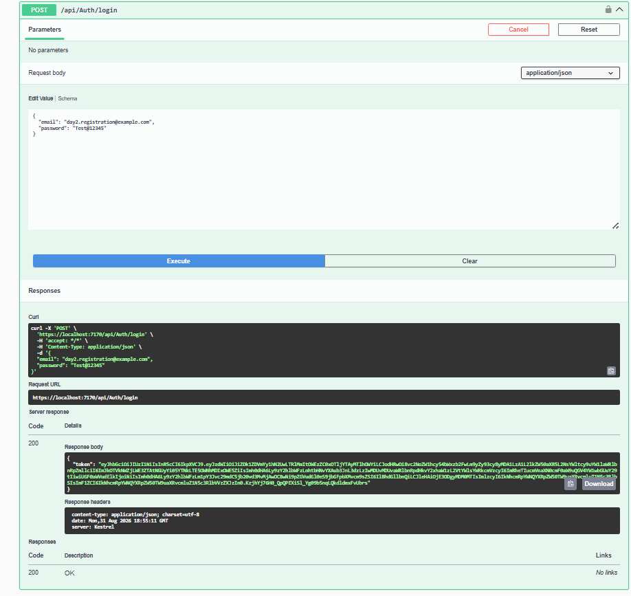
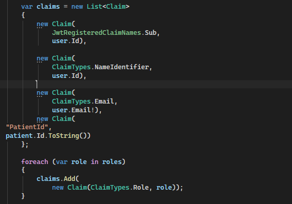
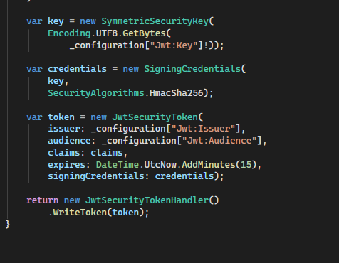
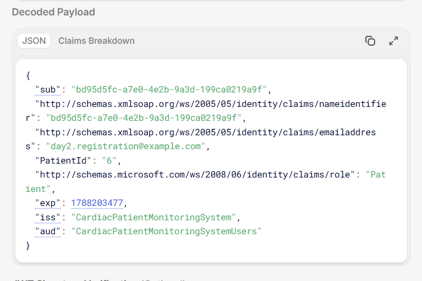

# Day 2 — JWT Login & Registration

## Overview

Day 2 focused on implementing the authentication and registration flow for the **Cardiac Patient Monitoring System** using **ASP.NET Core Identity and JWT**.

The implementation connects the `Patient` domain entity with its corresponding `ApplicationUser`, creates both records consistently during registration, assigns the `Patient` role, and generates a JWT containing a domain-specific `PatientId` claim.

---

## Learning Objectives

The following objectives were completed:

* Link the `Patient` domain entity to `ApplicationUser`.
* Create both Identity and domain records during registration.
* Maintain consistency using a database transaction.
* Assign the `Patient` role to newly registered users.
* Implement JWT-based login.
* Include the patient's domain ID in the JWT.
* Test the complete registration-to-login flow.
* Verify the generated JWT and its domain-specific claims.

---

# 1. Linking Patient to IdentityUser

The `Patient` entity is linked to the ASP.NET Core Identity `ApplicationUser` through the `UserId` foreign key.

This separates authentication responsibilities from domain-specific patient information:

* `ApplicationUser` manages identity information such as email, password, and roles.
* `Patient` stores patient-specific information such as full name, date of birth, gender, and medical history.
* `UserId` connects the two records.

The relationship is configured as a **one-to-zero/one relationship**, meaning an Identity user can have zero or one associated Patient profile.

### Evidence

---

# 2. Registration Creates Both Records

The registration process creates the Identity account and the corresponding Patient profile as part of the same registration flow.

The process is:

1. Create the `ApplicationUser` using ASP.NET Core Identity.
2. Create the `Patient` domain entity.
3. Link the Patient to the newly created Identity user through `UserId`.
4. Assign the `Patient` role.
5. Save the changes and commit the transaction.

This ensures that every successfully registered patient has both an authentication account and a corresponding domain profile.

### Evidence

---

# 3. Registration Transaction

The complete registration operation is protected by an Entity Framework Core database transaction.

The transaction ensures consistency between Identity and domain data.

If an important operation fails, such as Patient role assignment, the transaction is rolled back instead of leaving an incomplete registration.

The transaction is committed only after the required registration operations succeed.

This prevents an inconsistent state where an Identity user exists but the corresponding Patient profile or required role was not successfully created.

### Evidence

---

# 4. Patient Role Assignment

Newly registered users are assigned the `Patient` role.

The role is managed through ASP.NET Core Identity and is later included in the JWT as a role claim.

This allows the application to distinguish patients from other possible user roles and supports role-based authorization.

### Evidence

---

# 5. Registration Testing

The registration endpoint was tested successfully with a complete patient registration request.

The test included:

* Full name
* Date of birth
* Gender
* Phone number
* Email
* Password
* Medical history

The registration returned a successful response:

**Patient registered successfully.**

### Evidence

---

# 6. Login Flow

After registration, the same credentials were used to test the login flow.

The login process:

1. Finds the Identity user using the provided email.
2. Verifies the password using ASP.NET Core Identity.
3. Retrieves the Patient associated with the authenticated Identity user.
4. Retrieves the user's Identity roles.
5. Generates a JWT containing the required claims.
6. Returns the JWT to the client.

The Patient lookup connects the authenticated Identity account to its corresponding domain entity.

### Evidence

---

# 7. JWT Domain-Specific Claims

The generated JWT contains the standard identity information required by the application, together with a custom domain-specific claim.

The custom claim is:

**`PatientId`**

This claim contains the ID of the authenticated patient's domain record.

For example:

**PatientId: 6**

Including this value in the token allows authenticated requests to identify the patient's domain record directly.

### Evidence

---

# 8. JWT Token Generation

The JWT is generated after successful authentication and contains:

* User ID
* Email
* Patient ID
* User role
* Issuer
* Audience
* Expiration time

The token is signed using **HMAC-SHA256** and is configured with the application's JWT issuer and audience.

The token expiration is configured for **15 minutes**.

### Evidence

---

# 9. JWT Payload Verification

The generated JWT was decoded to verify that the expected claims were included.

The decoded payload contained:

* Identity user ID
* Email
* `PatientId`
* `Patient` role
* Expiration time
* Issuer
* Audience

The important domain-specific value was:

**`PatientId: 6`**

This confirms that the JWT is associated with the correct Patient domain entity.

### Evidence

---

# 10. Complete Registration-to-Login Flow

The complete flow was tested end-to-end:

**Registration**

→ Create Identity user

→ Create linked Patient profile

→ Assign Patient role

→ Commit transaction

→ Registration succeeds

→ **Login**

→ Find Identity user

→ Validate password

→ Find linked Patient

→ Generate JWT

→ Add `PatientId` claim

→ Return JWT

→ Decode and verify JWT

This end-to-end test verifies the integration between ASP.NET Core Identity, the Patient domain entity, and JWT authentication.

---

# 11. Testing Results

The following scenarios were successfully verified:

| Test                              | Result   |
| --------------------------------- | -------- |
| Patient registration              | ✅ Passed |
| Identity user creation            | ✅ Passed |
| Patient profile creation          | ✅ Passed |
| Identity–Patient relationship     | ✅ Passed |
| Patient role assignment           | ✅ Passed |
| Registration transaction          | ✅ Passed |
| Login with registered credentials | ✅ Passed |
| Patient lookup during login       | ✅ Passed |
| JWT generation                    | ✅ Passed |
| `PatientId` claim                 | ✅ Passed |
| Patient role claim                | ✅ Passed |
| JWT payload verification          | ✅ Passed |

---

# 12. Requirements Checklist

| Day 2 Requirement                              | Status      |
| ---------------------------------------------- | ----------- |
| Link a domain entity to IdentityUser           | ✅ Completed |
| Registration creates both records together     | ✅ Completed |
| Use a transaction for registration consistency | ✅ Completed |
| Issue JWTs with domain-relevant claims         | ✅ Completed |
| Test the full registration-to-login flow       | ✅ Completed |
| Verify the generated JWT                       | ✅ Completed |
| Verify the domain-specific PatientId claim     | ✅ Completed |

---

# 13. Key Concepts Learned

### Identity and Domain Separation

Authentication-related information is handled by ASP.NET Core Identity, while patient-specific information is maintained by the `Patient` domain entity.

### Entity Relationship

The `Patient` entity is connected to its Identity user through `UserId`, allowing the application to determine which Patient belongs to an authenticated user.

### Database Transactions

Transactions keep the registration process consistent by ensuring that related operations succeed together or are rolled back when an important operation fails.

### Domain-Specific JWT Claims

The `PatientId` claim carries application-specific information inside the JWT, allowing the authenticated user to be associated directly with the corresponding Patient record.

### End-to-End Authentication Testing

Testing registration, login, Patient lookup, JWT generation, and JWT decoding together verifies the complete authentication workflow rather than testing each component in isolation.

---

# 14. Tools Used

* ASP.NET Core
* ASP.NET Core Identity
* Entity Framework Core
* JWT
* SQL Server
* Swagger
* Postman
* C#
* .NET 9

---

# Day 2 Result

The **Cardiac Patient Monitoring System** now has a complete Identity-based registration and JWT authentication flow.

Each registered patient is associated with an Identity account and receives a JWT containing the necessary authentication information, including the domain-specific `PatientId` and `Patient` role.

**Day 2 requirements were successfully implemented and tested end-to-end.**
