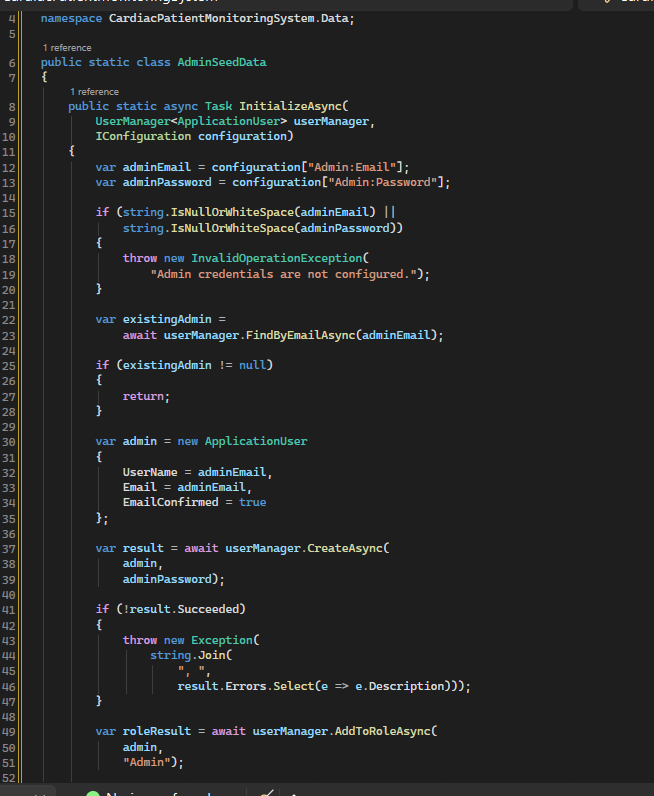
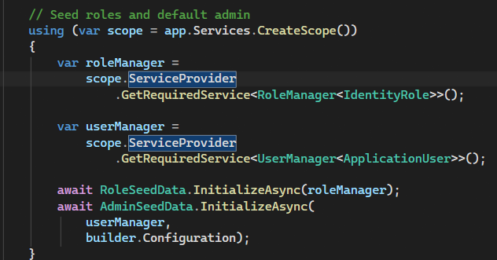
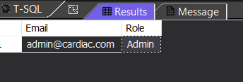
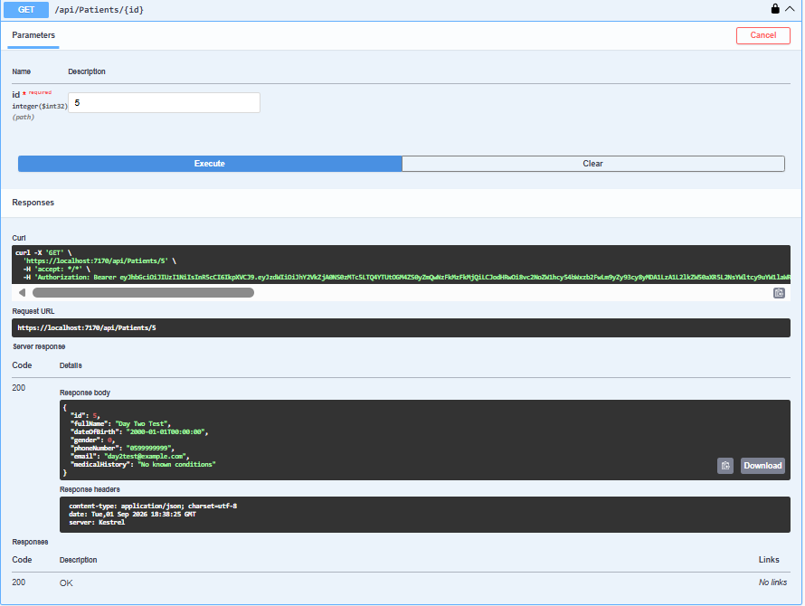
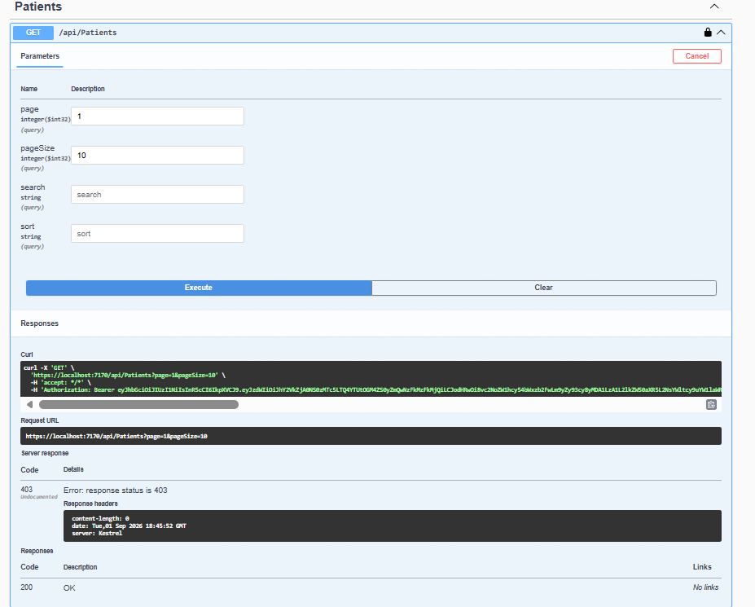
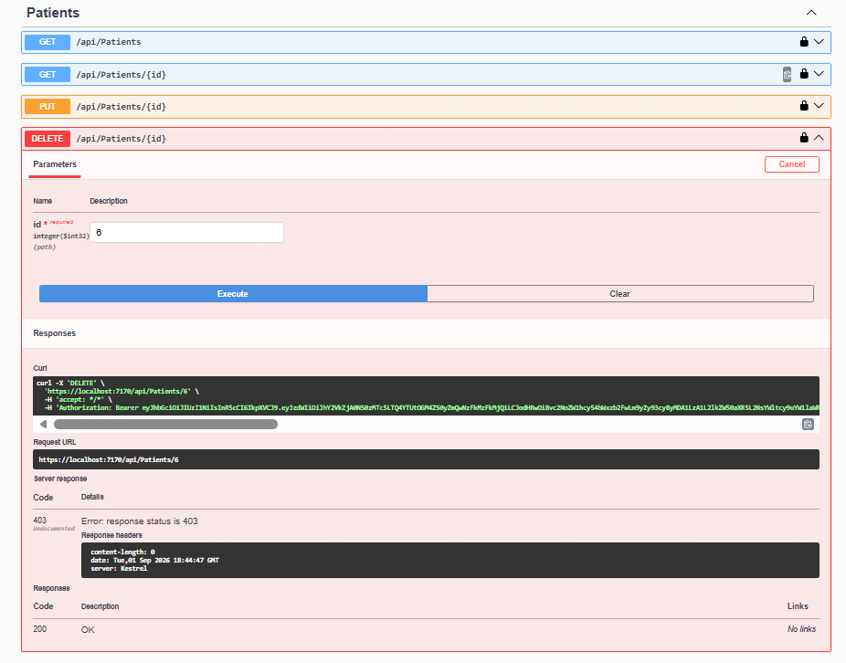

# Day 3 — Role-Based Access Control

## Overview

This day focused on implementing **Role-Based Access Control (RBAC)** and **resource ownership authorization** in the Cardiac Patient Monitoring System.

The main goal was to ensure that:

* Patients can access only their own data.
* Admins can access and manage patient data.
* Admin-only endpoints are protected.
* Public registration does not allow users to register as Admin.

---

## 1. Role Assignment

### Patient Role

New users registered through the public registration endpoint are assigned the **Patient** role by default.

Patients are therefore not able to assign themselves administrative privileges.

### Admin Role

An initial Admin account is created through a protected seeding process.

Admin credentials are stored securely using **.NET User Secrets** rather than being hardcoded in the source code.

### Admin Seeding

The Admin seeding process retrieves the credentials from configuration, creates the Admin account if it does not already exist, and assigns the **Admin** role.

The application initializes both the role data and the Admin account during startup.

The seeded Admin account and its assigned role were verified in the database.

---

## 2. Endpoint Authorization

Authorization was reviewed across all controllers according to the required access level.

| Controller             | Access          |
| ---------------------- | --------------- |
| AuthController         | Public          |
| PatientsController     | Patient / Admin |
| VitalSignsController   | Patient         |
| MedicationsController  | Patient         |
| AppointmentsController | Patient         |

Authenticated Patient endpoints use the authenticated user's identity from the JWT token.

Admin management endpoints require the **Admin** role.

---

## 3. Resource Ownership

Role-based authorization alone is not enough to protect patient resources.

For patient-specific resources, ownership checks were implemented to ensure that a Patient can access only records belonging to their own account.

For example, when requesting a patient profile:

* The authenticated Patient ID is retrieved from the JWT claims.
* The requested resource ID is compared with the authenticated Patient ID.
* Access is allowed only when both IDs belong to the same patient.
* Access to another patient's resource is rejected with **403 Forbidden**.

---

## 4. Authorization Testing

### Patient Accessing Own Resource

A Patient successfully accessed their own patient profile.

**Expected:** `200 OK`

### Patient Accessing Another Patient's Resource

A Patient attempted to access another patient's profile.

**Expected:** `403 Forbidden`

### Patient Accessing Admin-Only Endpoint

A Patient attempted to access the endpoint that retrieves all patients.

**Expected:** `403 Forbidden`

### Patient Attempting Admin Delete Operation

A Patient attempted to delete another patient's record through an Admin-only endpoint.

**Expected:** `403 Forbidden`

The request was rejected by authorization before the delete operation was executed.

---

## 5. Day 3 Outcome

The Cardiac Patient Monitoring System now implements:

* Default **Patient** role assignment.
* Secure Admin seeding using User Secrets.
* Role-based endpoint authorization.
* Admin-only management endpoints.
* Patient resource ownership validation.
* JWT-based identity and role authorization.
* Successful authorization testing using `200 OK` and `403 Forbidden` scenarios.

These changes ensure that users can access only the resources and operations permitted by their role and ownership.
