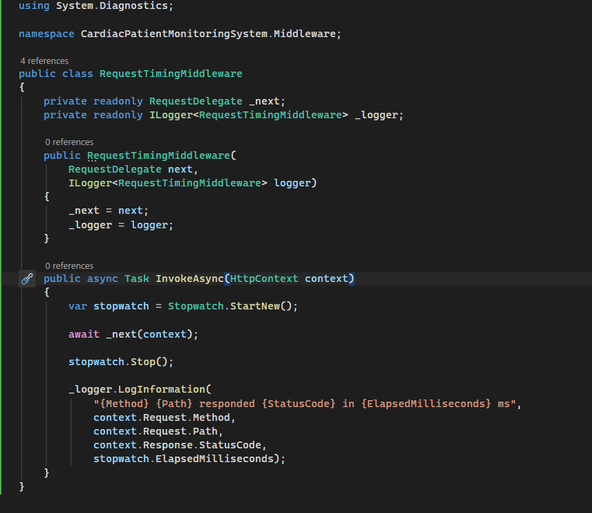
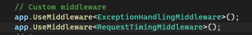

# Day 4 — Custom Middleware & Cross-Cutting Concerns

## Overview

This day focused on identifying and implementing a custom cross-cutting concern using ASP.NET Core middleware.

A **Request Timing Middleware** was implemented to monitor incoming HTTP requests and log:

* HTTP Method
* Request Path
* Response Status Code
* Request Execution Time

The middleware is applied globally, without requiring changes to individual controllers or endpoints.

---

## 1. Identifying a Cross-Cutting Concern

Request timing and logging were selected as a genuine cross-cutting concern because they can be applied consistently across the application and are not specific to any business operation.

The goal was to measure how long each HTTP request takes and record the result for monitoring and debugging purposes.

---

## 2. Custom Middleware Implementation

A custom `RequestTimingMiddleware` was implemented using `RequestDelegate` and `Stopwatch`.

The middleware:

1. Starts a timer when a request enters the pipeline.
2. Passes the request to the next middleware.
3. Stops the timer after the request is completed.
4. Logs the HTTP method, path, status code, and execution time.

---

## 3. Middleware Pipeline Registration

The custom middleware was registered in `Program.cs` as part of the ASP.NET Core request pipeline.

It works globally, so the timing information is automatically captured for different endpoints without adding code to each controller.

---

## 4. Middleware vs Action Filters

Middleware was selected because request timing is a concern that applies to the overall HTTP request pipeline rather than a specific controller action.

Unlike action filters, middleware can observe requests across the entire application pipeline.

---

## 5. Testing

The middleware was tested using multiple API requests to verify that it consistently logs different response outcomes.

### Successful Request

`GET /api/Patients/5`

* Status Code: `200`
* Execution Time: `172 ms`

### Forbidden Request

`GET /api/Patients/6`

* Status Code: `403`
* Execution Time: `8 ms`

The logs confirm that the middleware is applied consistently to both successful and forbidden requests.

---

## 6. Outcome

By the end of Day 4:

* A genuine cross-cutting concern was identified.
* Custom ASP.NET Core middleware was implemented.
* The middleware was registered globally.
* Request timing and response status codes were logged.
* The implementation was tested across multiple endpoints.
* The project was committed and pushed to the `main` branch, ready for mentor review.
