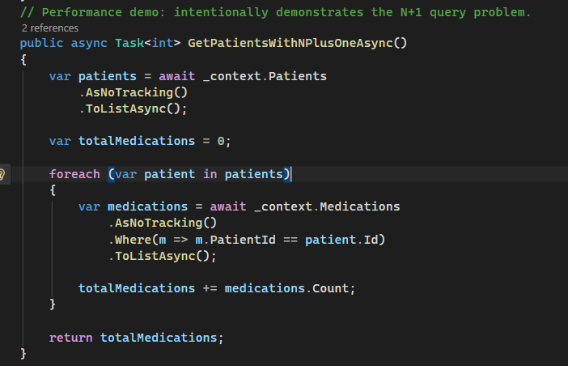
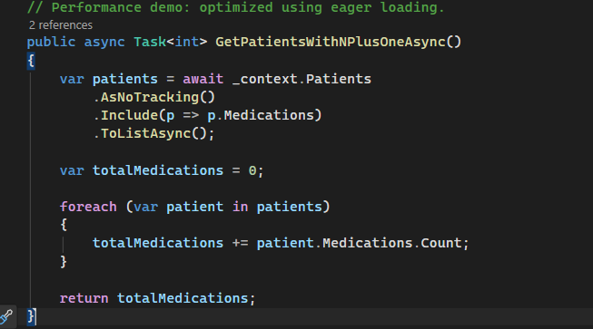
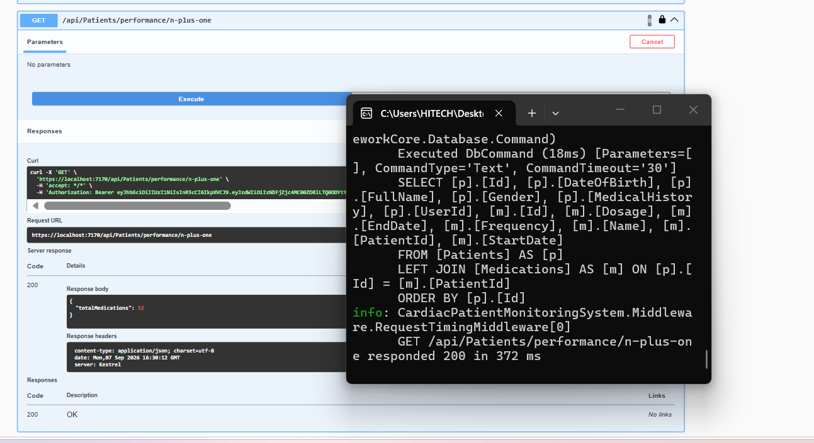
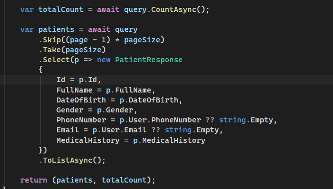
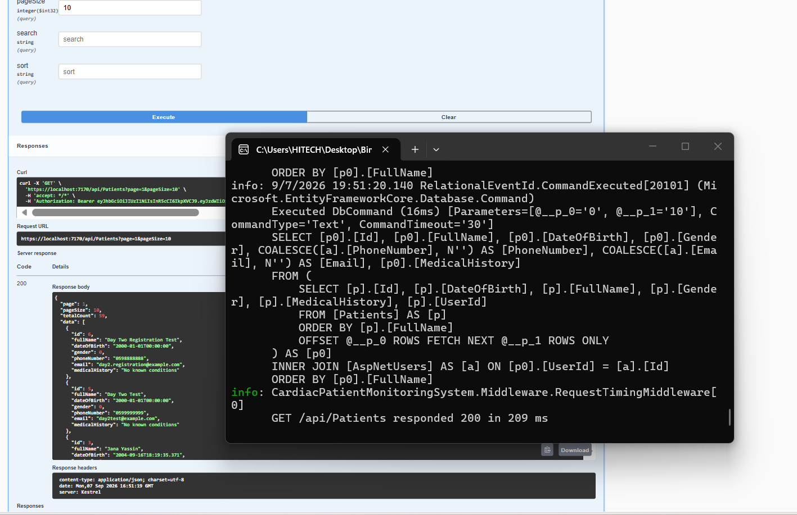
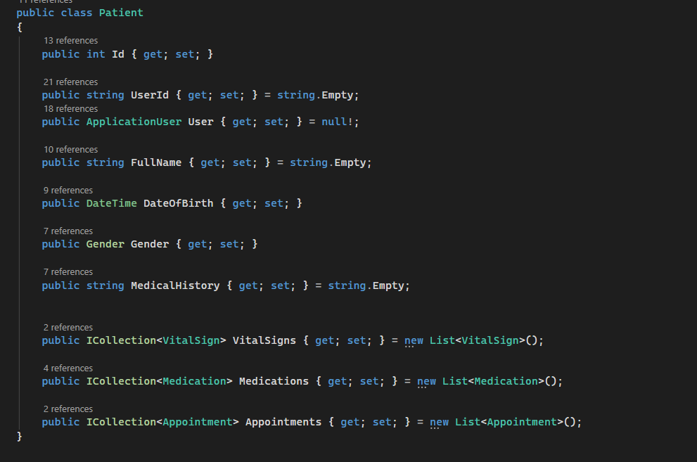
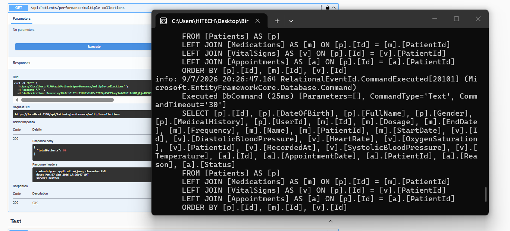
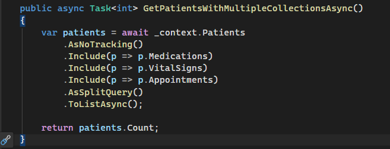
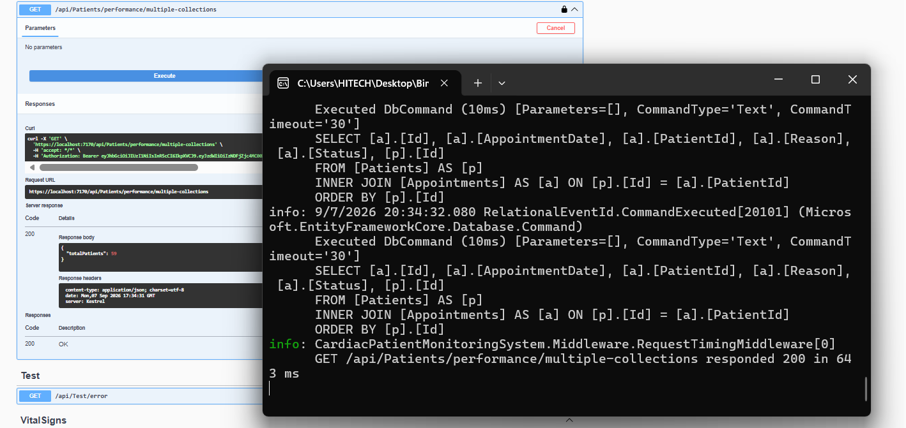

# Day 2 — Query Optimization with Eager Loading, Projection & Split Queries

## Overview

Day 2 focused on optimizing Entity Framework Core queries by addressing the N+1 query problem, using eager loading with `Include`, validating projection-based queries, and applying `AsSplitQuery` when loading multiple collection navigations.

The main goal was to reduce unnecessary database round-trips and understand the trade-offs between different EF Core loading strategies.

---

## 1. Fixing the N+1 Query Problem

The `GET /api/Patients/performance/n-plus-one` endpoint was used to demonstrate the N+1 query problem.

### Before Optimization

The original implementation first loaded all patients and then executed a separate database query for each patient's medications.

With **58 patients**, this resulted in:

* **1 query** to retrieve patients
* **58 additional queries** to retrieve medications
* **59 SQL queries in total**
* Baseline response time: **285 ms**

### Eager Loading with Include

The endpoint was optimized using EF Core eager loading with `Include(p => p.Medications)`.

This loads the patients and their medications through a single SQL query.

After optimization, EF Core generated a single query using a `LEFT JOIN` between `Patients` and `Medications`.

### Result

| Metric        | Before |  After |
| ------------- | -----: | -----: |
| Patients      |     58 |     58 |
| SQL Queries   |     59 |      1 |
| Response Time | 285 ms | 372 ms |

The main improvement was the reduction in database round-trips from **59 queries to 1 query**.

The response time should not be considered a direct performance improvement in this test because it can be affected by application startup, serialization, logging, and other runtime factors.

---

## 2. Projection with Select

The `GET /api/Patients` list endpoint already uses projection with `Select()` to return only the fields required by `PatientResponse`.

Instead of loading complete `Patient` entities and related data, the query directly projects the required fields into the response DTO.

The endpoint was tested using:

`GET /api/Patients?page=1&pageSize=10`

The generated SQL selected only the required DTO fields and used an `INNER JOIN` with `AspNetUsers`.

It also applied pagination using `OFFSET/FETCH`.

### Measurement

* SQL execution time: **16 ms**
* Request response time: **209 ms**
* Returned page size: **10 patients**

Projection helps reduce unnecessary data loading because the database returns only the columns required by the API response.

---

## 3. Loading Multiple Collections

The `Patient` entity contains multiple collection navigations:

* `Medications`
* `VitalSigns`
* `Appointments`

Loading all three collections using regular `Include()` generated one large SQL query containing multiple `LEFT JOIN` operations.

### Before AsSplitQuery

The generated query joined:

* `Patients`
* `Medications`
* `VitalSigns`
* `Appointments`

This can result in **Cartesian explosion**, where combinations of related collection rows cause the database result set to become much larger than necessary.

The endpoint response time in this run was **447 ms**.

---

## 4. Applying AsSplitQuery

To avoid combining multiple collection joins into one large result set, `AsSplitQuery()` was added to the query.

With split queries enabled, EF Core executed separate SQL queries for the related collections instead of generating one large query with all collection joins.

The endpoint generated separate queries for:

1. Patients
2. Medications
3. VitalSigns
4. Appointments

The captured log shows the separate `Appointments` query and the successful endpoint response.

### Measurement

| Scenario                |        SQL Queries | Response Time |
| ----------------------- | -----------------: | ------------: |
| Before `AsSplitQuery()` |      1 large query |        447 ms |
| After `AsSplitQuery()`  | 4 separate queries |        643 ms |

The purpose of `AsSplitQuery()` is not necessarily to reduce the number of SQL queries or guarantee a faster response.

Instead, it helps avoid **Cartesian explosion** by separating multiple collection loads into simpler SQL queries.

The response time was higher in this test, so the improvement is demonstrated by the **query structure and reduced result-set multiplication**, not by lower response time.

---

## 5. Before & After Summary

| Optimization         | Before             | After                                                |
| -------------------- | ------------------ | ---------------------------------------------------- |
| N+1 Problem          | 59 SQL queries     | 1 SQL query                                          |
| Projection           | Entity loading     | DTO projection                                       |
| Multiple Collections | 1 large JOIN query | 4 separate queries                                   |
| Main Benefit         | Reduce round-trips | Avoid unnecessary data loading / Cartesian explosion |

---

## 6. Key Concepts Learned

### Eager Loading

`Include()` loads related data together with the main entity query.

### Projection

`Select()` allows the application to retrieve only the fields required by the response instead of loading complete entities.

### Split Queries

`AsSplitQuery()` separates queries for multiple collection navigations to avoid excessive row multiplication caused by multiple joins.

### Query Measurement

EF Core SQL logging and the custom `RequestTimingMiddleware` were used to observe:

* Number of SQL queries
* Generated SQL structure
* SQL execution time
* Overall request response time

---

## Outcome

Day 2 successfully demonstrated three important EF Core query optimization techniques:

* Fixed an N+1 query problem using eager loading.
* Validated projection-based querying for list endpoints.
* Applied `AsSplitQuery()` when loading multiple collections to avoid Cartesian explosion.

The most significant measured improvement was reducing the N+1 endpoint from **59 SQL queries to 1 query**.
