# Day 3 — Introducing Redis Caching

## Overview

Day 3 focused on introducing Redis caching into the Cardiac Patient Monitoring System using ASP.NET Core's `IDistributedCache` abstraction.

Because patient and vital-sign data are sensitive and frequently changing, the patient list and individual patient records were not selected for caching. Instead, the patient count aggregate was chosen as a suitable cache candidate because it is lightweight, frequently requested, and does not expose patient details.

---

## 1. Redis Setup

Redis was configured locally using Docker.

The Redis container was started with:

```bash
docker run --name redis -p 6379:6379 -d redis
```

The running container was verified successfully.

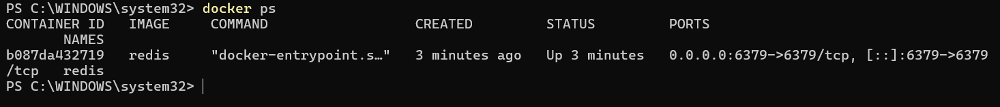

---

## 2. Redis Package Installation

The `Microsoft.Extensions.Caching.StackExchangeRedis` package was installed to integrate Redis with ASP.NET Core's distributed caching abstraction.

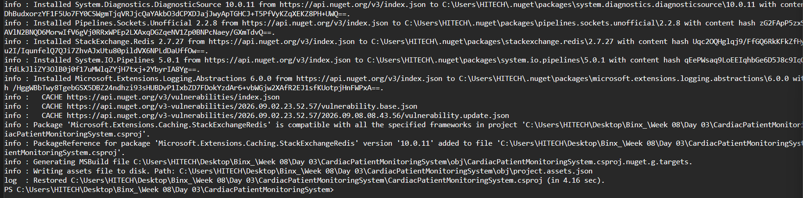

---

## 3. Registering IDistributedCache

Redis was registered in `Program.cs` using the Redis connection string:

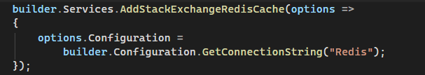

The application connects to Redis through:

```text
localhost:6379
```

---

## 4. Choosing a Cache Candidate

The selected cache candidate was:

**GET `/api/Patients/statistics/count`**

The patient count was chosen because:

* It is an aggregate value.
* It is lightweight to store.
* It does not expose sensitive patient information.
* It can be requested frequently.
* It does not change on every request.

Caching the full patient list was avoided because patient information is sensitive, subject to authorization rules, and can change frequently.

---

## 5. Cache-Aside Pattern

The patient count endpoint implements the **Cache-Aside Pattern**.

The flow is:

```text
Request
   ↓
Check Redis
   ↓
Cache Hit ──────→ Return cached count
   ↓
Cache Miss
   ↓
Query SQL Server
   ↓
Store result in Redis
   ↓
Return count
```

The cache entry uses an absolute expiration of **5 minutes**.

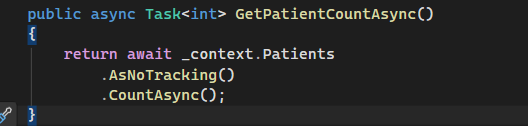

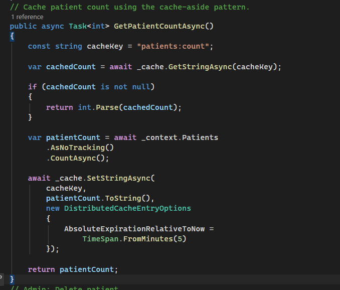

---

## 6. Cache Invalidation

Cache invalidation was implemented to prevent the patient count from becoming stale after database changes.

The cache key used is:

```text
patients:count
```

The cached value is removed after patient-related writes.

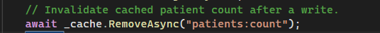

### Create

When a new patient is registered, the patient is first saved successfully and the transaction is committed. The cached patient count is then invalidated.

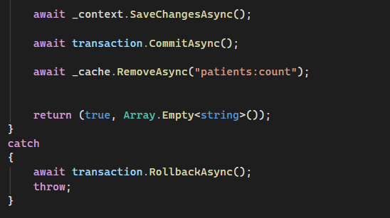

The registration was tested successfully with a new patient.

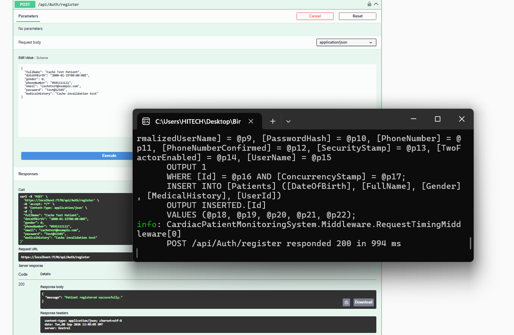

After the registration, requesting the patient count triggered a new SQL `COUNT(*)` query, confirming that the previous cached value had been invalidated.

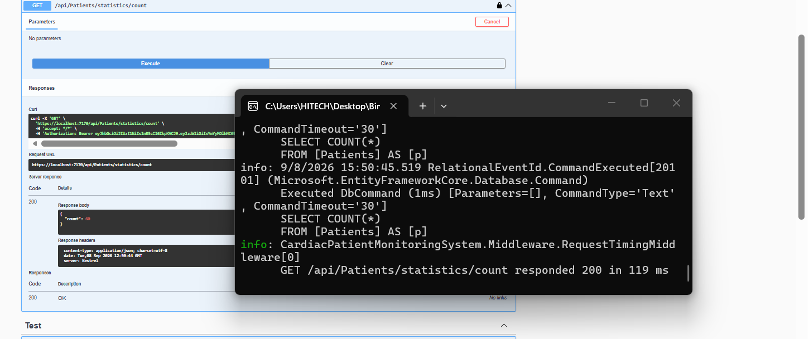

### Update

The patient update operation also removes the `patients:count` cache entry after the database update.

Although updating a patient does not change the total patient count, the invalidation demonstrates the cache invalidation mechanism after a write operation.

### Delete

When a patient is deleted, the `patients:count` cache entry is removed.

After deleting a patient, the next patient-count request triggered a new SQL `COUNT(*)` query, confirming that the cached value was invalidated.

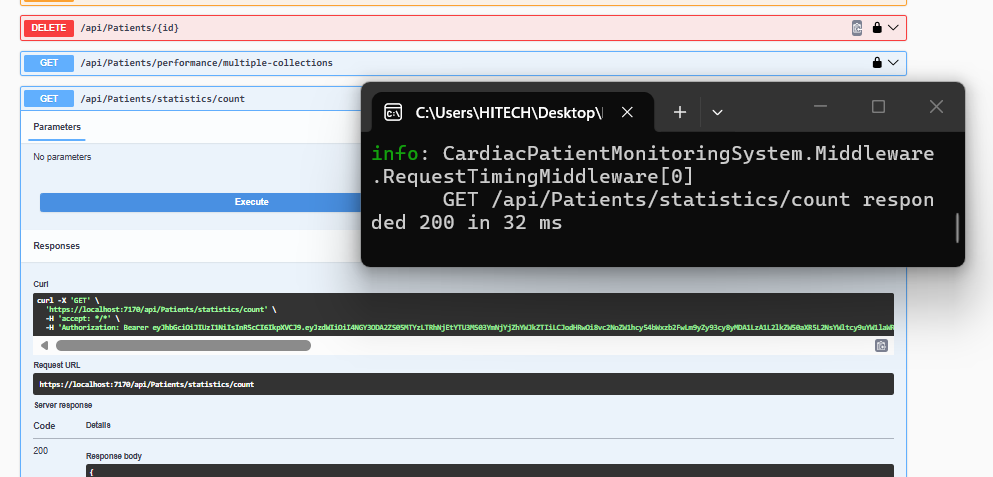

---

## 7. Cache Miss vs Cache Hit

### Cache Miss

The first request to the patient count endpoint resulted in a cache miss.

SQL Server executed:

```sql
SELECT COUNT(*)
FROM [Patients] AS [p]
```

The request completed in approximately **695 ms**.

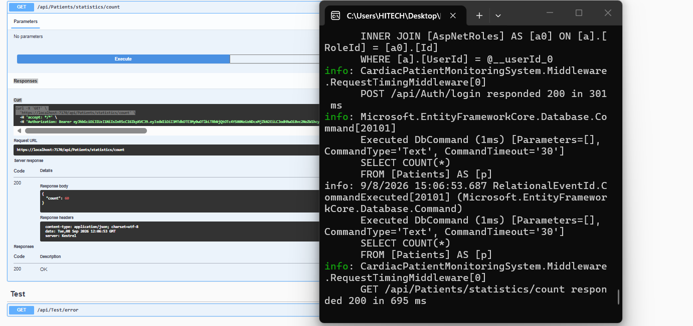

### Cache Hit

The following request was served directly from Redis.

No SQL `COUNT(*)` query was executed, and the request completed in approximately **24 ms**.

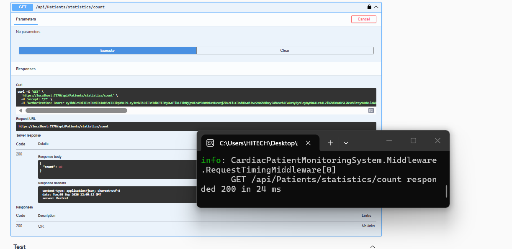

These measurements demonstrate the reduced database work and faster response observed when the value is available in Redis.

---

## 8. Key Concepts Demonstrated

### Cache-Aside

The application checks the cache first and queries the database only when the value is not cached.

### Cache Expiration

The patient count is cached for **5 minutes** using `DistributedCacheEntryOptions`.

### Cache Invalidation

The cached patient count is removed after relevant write operations so that subsequent requests retrieve the latest value from SQL Server.

### Distributed Cache Abstraction

ASP.NET Core's `IDistributedCache` abstraction allows the application to work with Redis without directly coupling the service logic to Redis-specific APIs.

---

## 9. Outcome

By the end of Day 3:

* Redis was successfully integrated using Docker.
* `IDistributedCache` was registered in the application.
* The patient count endpoint was implemented using the Cache-Aside pattern.
* A 5-minute cache expiration was configured.
* Cache hits and misses were tested.
* Cache invalidation was implemented for patient-related writes.
* Create and Delete invalidation were verified through SQL query logs.
* Cache miss and cache hit response times were measured.
* The application avoids caching sensitive patient data unnecessarily.
