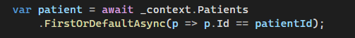
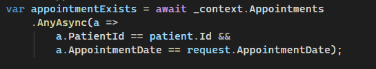
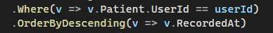
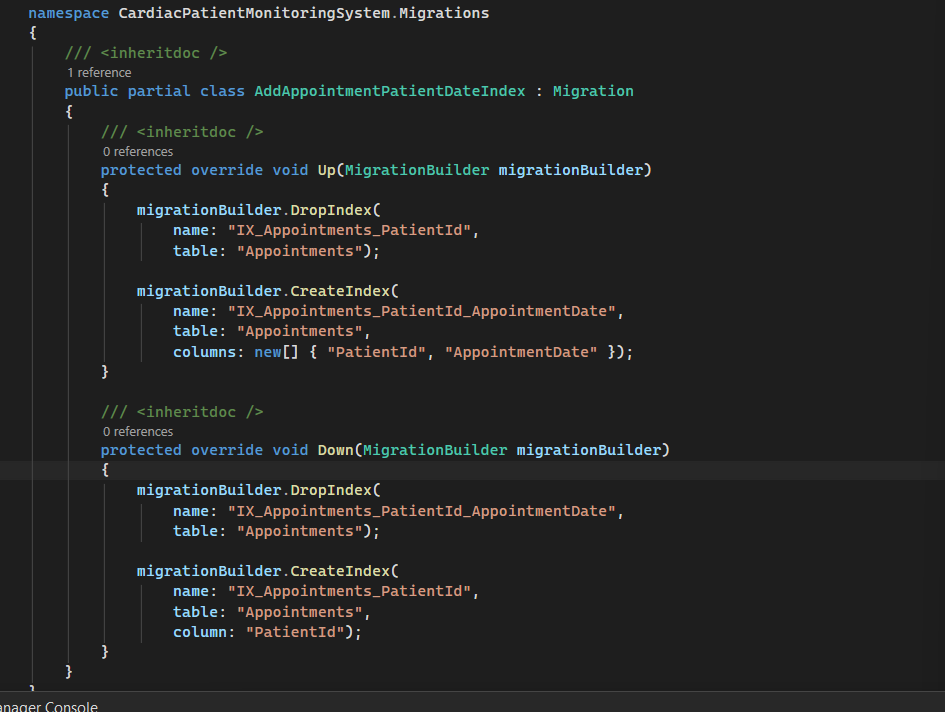
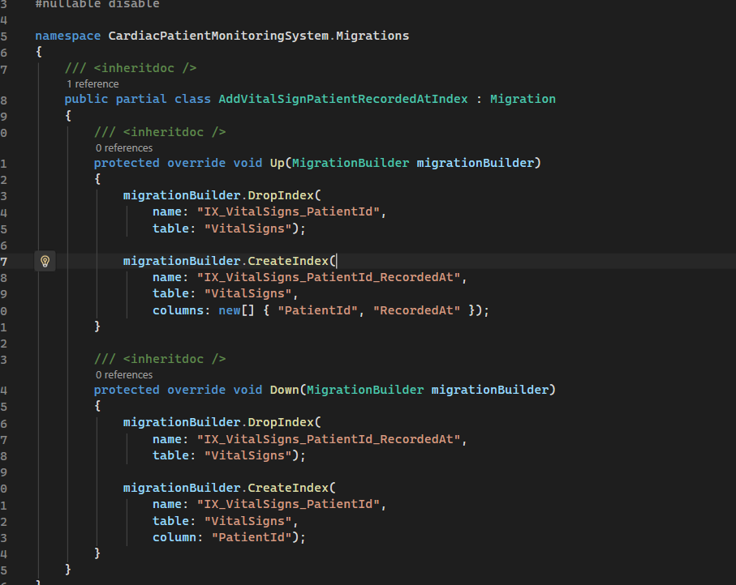
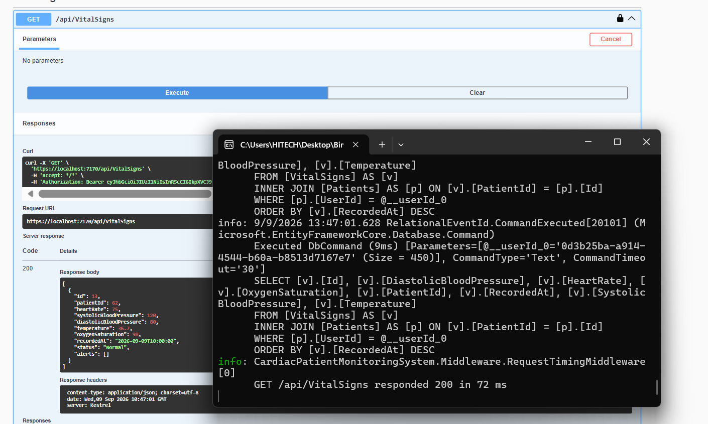
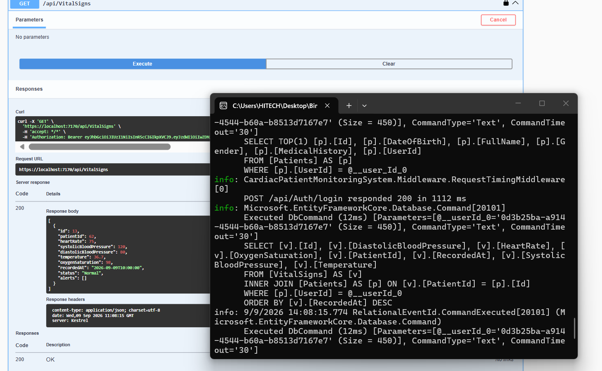
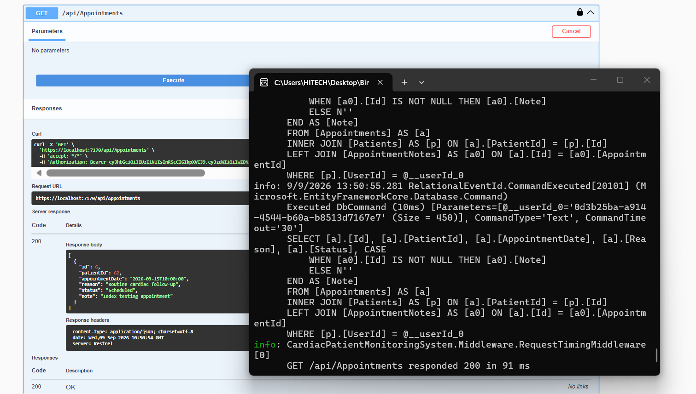
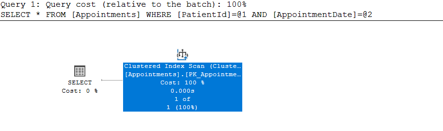
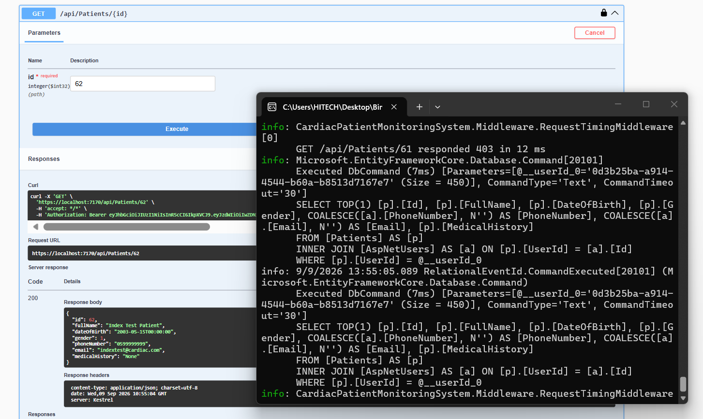

# Week 08 — Day 04

## Database Indexing & Performance Profiling

### Overview

Day 04 focused on improving database query performance by identifying suitable index candidates, adding indexes using EF Core Fluent API, creating migrations, and profiling queries using SQL Server execution plans.

The goal was not only to add indexes, but also to verify whether SQL Server actually uses them and document the observed behavior.

---

## 1. Identifying Index Candidates

Before adding indexes, frequently filtered, joined, and sorted columns were reviewed.

Three suitable candidates were identified:

### Patient — `UserId`

`UserId` is frequently used when retrieving a patient based on the authenticated Identity user.



### Appointments — `PatientId + AppointmentDate`

Appointments are commonly queried using both the patient and appointment date. Therefore, a composite index was considered appropriate.



### VitalSigns — `PatientId + RecordedAt`

Vital signs are frequently retrieved for a specific patient and ordered or filtered by their recording time.



---

## 2. Index Configuration

The indexes were configured using EF Core Fluent API inside `AppDbContext`.

```csharp
// Index for frequent UserId lookups
modelBuilder.Entity<Patient>()
    .HasIndex(p => p.UserId);

// Composite index for appointment queries
modelBuilder.Entity<Appointment>()
    .HasIndex(a => new { a.PatientId, a.AppointmentDate });

// Composite index for vital sign queries
modelBuilder.Entity<VitalSign>()
    .HasIndex(v => new { v.PatientId, v.RecordedAt });
```

The composite indexes were selected because the corresponding queries commonly use the two columns together.

---

## 3. EF Core Migrations

### Appointment Composite Index

A migration was created to replace the existing single-column `PatientId` index with the composite index:

```text
IX_Appointments_PatientId_AppointmentDate
```



### VitalSigns Composite Index

A migration was also created for:

```text
IX_VitalSigns_PatientId_RecordedAt
```



### Patient `UserId`

The `Patient.UserId` index already existed in the initial migration as a unique index.

Therefore, creating another migration for it produced an empty migration because the EF Core model and snapshot were already synchronized.

---

# 4. Performance Profiling

Performance was checked before and after the indexing changes.

The baseline measurements were:

| Query                                        | SQL Time | Request Time |
| -------------------------------------------- | -------: | -----------: |
| `Patients.UserId`                            |     7 ms |        43 ms |
| `VitalSigns (PatientId + RecordedAt)`        |     9 ms |        72 ms |
| `Appointments (PatientId + AppointmentDate)` |    10 ms |        91 ms |

Because the test database contains a small amount of data, execution-plan timing is very small and may appear as `0.000s`. Therefore, the execution plans were used primarily to verify whether SQL Server selected the created indexes rather than claiming an artificial percentage improvement.

---

# 5. VitalSigns — Before Index

Before adding the composite index, the VitalSigns query was profiled using the baseline execution.



The baseline SQL execution time was approximately **9 ms**, with an overall request time of approximately **72 ms**.

---

# 6. VitalSigns — After Index

After adding the composite index:

```text
IX_VitalSigns_PatientId_RecordedAt
```

the query execution plan was inspected.



The execution plan shows:

* `Index Seek (NonClustered)` on `Patients`
* `Index Seek (NonClustered)` on `VitalSigns`
* `Key Lookup (Clustered)` on `VitalSigns`

Most importantly, SQL Server used the composite VitalSigns index through an **Index Seek**, confirming that the index was useful for the tested query.

The displayed execution-plan time was `0.000s`, which is too coarse to claim a reliable numerical improvement for this small dataset.

---

# 7. Appointments — Before Index

Before adding the composite index, the appointment query was measured using the baseline configuration.



The baseline SQL execution time was approximately **10 ms**, with an overall request time of approximately **91 ms**.

---

# 8. Appointments — After Index

After creating:

```text
IX_Appointments_PatientId_AppointmentDate
```

the following query was tested:

```sql
SELECT *
FROM [Appointments]
WHERE [PatientId] = @1
  AND [AppointmentDate] = @2;
```



The execution plan showed:

```text
Clustered Index Scan
```

on:

```text
PK_Appointments
```

rather than using the newly created composite index.

This does not mean that the index was incorrectly created. SQL Server's optimizer chooses the execution plan it estimates to be cheapest. With the current small dataset, scanning the clustered table can be cheaper than using a nonclustered index followed by additional lookups.

Therefore, **no performance improvement is claimed for the tested Appointments query**.

---

# 9. Patient `UserId` Index

The `Patient.UserId` column already had a unique index created by the initial migration.



The baseline measurement for the query was approximately:

* SQL Time: **7 ms**
* Request Time: **43 ms**

Since the index already existed in the initial database schema, no additional migration was required for this index.

---

# 10. Before vs After Summary

| Query                                        | Before                    | After / Execution Plan | Result                |
| -------------------------------------------- | ------------------------- | ---------------------- | --------------------- |
| `Patients.UserId`                            | 7 ms SQL / 43 ms request  | Existing unique index  | Index already present |
| `VitalSigns (PatientId + RecordedAt)`        | 9 ms SQL / 72 ms request  | Composite Index Seek   | Index used            |
| `Appointments (PatientId + AppointmentDate)` | 10 ms SQL / 91 ms request | Clustered Index Scan   | Index not selected    |

Because the dataset is small and the execution-plan timings are displayed as `0.000s`, exact numerical performance improvements cannot be reliably calculated.

The important result is the actual optimizer behavior observed in the execution plans.

---

# 11. Key Findings

### VitalSigns

The composite index:

```text
(PatientId, RecordedAt)
```

was successfully created and selected by SQL Server through an **Index Seek**.

This confirms that the index matches the access pattern of the tested VitalSigns query.

### Appointments

The composite index:

```text
(PatientId, AppointmentDate)
```

was successfully created, but SQL Server chose a **Clustered Index Scan** for the tested query.

This demonstrates that creating an index does not guarantee that SQL Server will use it. The optimizer considers factors such as table size, selectivity, and estimated query cost.

### Patients

The `UserId` index was already present from the initial database migration, so no additional migration was necessary.

---

# 12. Conclusion

Day 04 demonstrated the complete indexing and performance-profiling workflow:

1. Identify frequently queried columns.
2. Select appropriate single-column or composite indexes.
3. Configure indexes using EF Core Fluent API.
4. Create and apply EF Core migrations.
5. Measure baseline query performance.
6. Inspect execution plans after indexing.
7. Verify whether SQL Server actually uses the indexes.
8. Document the observed performance behavior without making unsupported claims.

The profiling results showed that the VitalSigns composite index was actively used through an Index Seek, while the Appointments composite index was not selected for the tested query because the optimizer determined that a clustered scan was cheaper for the current dataset.
